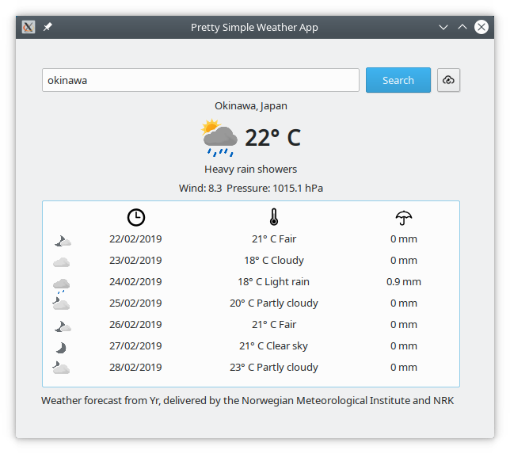

# psimpleweather
Pretty Simple Weather app

I think YR service from the Norwegian Meteorological Institute is one of the most precise weather services around in the web.

I am building a simple application that queries results from YR.no site.

Data can be freely consumed from their servers through a service that returns an XML (it is not Soap).

The information is huge: an XML file with a week forecast split in 6-hours blocks providing timezone, altitude, longitude, temperature, precipitation, pressure, wind speed, wind direction. Although it does not provide humidity... odd.

YR.no does not provide a service to look for cities, however it does provide a tab separated file with 16.000 major places to query. That means, cities with more than 500k inhabitants. So I dumped it into a db file in order to query it.

So, here is my first attempt of a <i>Pretty Simple Weather App</i> and it is in early stage!

The application is written in Python + pyQT5

What it does:
- you can query: "City" or "City, Country"
- Provide today's maximum temperature and weather condition
- Provide a forecast of the following week, always showing maximum temperature.

What it does not:
- Does not provide humidity
- Can not search for other cities smaller than capitals.

To-do:
- Build a complete database (download a complete zip file from Geonames.org)
- Query a json to Geonames

R&D:
- Make suggestions while typing a city (Ajax?)
- Semi-transparent window
